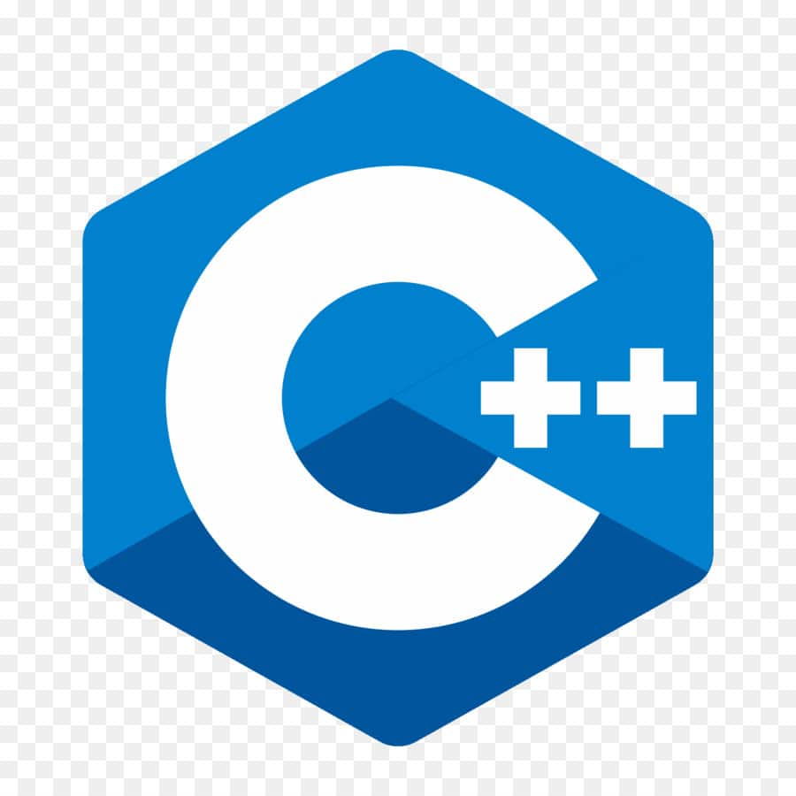

<p align="Center"></p>
<h5 align="Center">1Q2 - Programmation structurée</h5>

# 🏋🏻‍♂️ Exercices 04 - La mathématique

#### Voir la [structure à utiliser.](../_includes/_rules.md)

## Question 01 - Hypothénuse

Programmer une fonction C++ permettant de calculer l'hypothénuse d'un triangle-rectangle arrondis à deux décimales près.

```plaintext
Entrez la longueur du premier côté: 10
Entrez la longueur du deuxième côté: 15
L'hypoténuse du triangle est: 18.03
```

## Question 02 - Appelation

Programmer une fonction C++ permettant d'afficher une appelation différente selon l'âge de la personne :

1. < 40ans, donner son âge complet.
2. Dans la quarantaire, afficher `quadragénaire`.
3. Dans la cinquantaire, afficher `quinquagénaire`.
4. Dans la soixantaine, afficher `sexagénaire`.
5. Autre: afficher `à la retraîte`.

N.B. Vous devez utiliser minimalement un `switch` dans votre algorithme.

```plaintext
Veuillez entrer votre âge (1 à 120) : 39
Vous êtes agé de 39 ans.
```

```plaintext
Veuillez entrer votre âge (1 à 120) : 40
Vous êtes quadragénaire.
```

```plaintext
Veuillez entrer votre âge (1 à 120) : 69
Vous êtes sexagénaire.
```

```plaintext
Veuillez entrer votre âge (1 à 120) : 110
Vous êtes à la retraîte.
```

```plaintext
Veuillez entrer votre âge (1 à 120) : 130
Age invalide (130).
```

## Question 03 - Poid Ballon

Écrire une fonction C++ permettant de calculer le poid total d'un ballon remplis d'eau pure et qui affiche, au singulier ou au pluriel, le poid total.

```plaintext
Entrer le poids du ballon vide (en kg) : 0.2
Entrez le diamètre du ballon (en cm) : 25
Le poid du ballon plein d'eau est de 8.38 kgs.
```

```plaintext
Entrer le poids du ballon vide (en kg) : 0.2
Entrez le diamètre du ballon (en cm) : 12
Le poid du ballon plein d'eau est de 1.1 kgs.
```

```plaintext
Entrer le poids du ballon vide (en kg) : 0.1
Entrez le diamètre du ballon (en cm) : 10
Le poid du ballon plein d'eau est de 0.62 kg.
```

<hr><p align="Center"></p>
