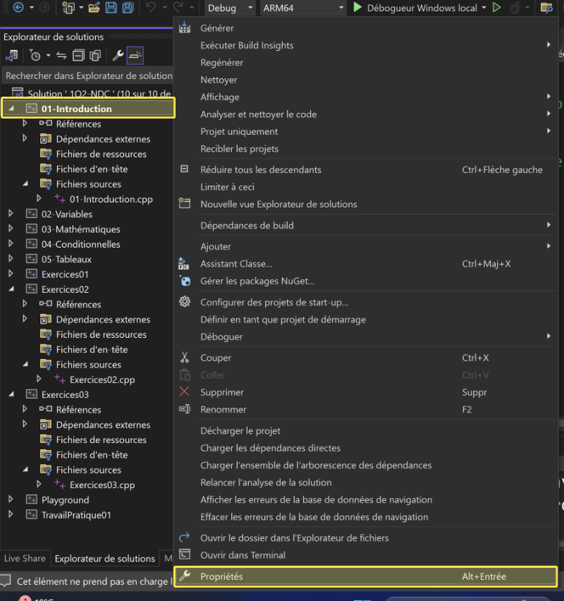
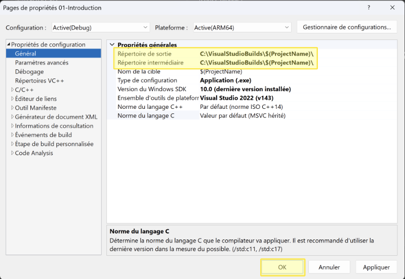

# Configuration des répertoires de compilation des projets dans Visual Studio

## Mise en contexte

Nous avons choisi de sécuriser nos travaux dans le cours de Programmation Structurée en enregistrant les fichiers de projet dans nos OneDrive d'école. Quoique ceci soit une bonne pratique elle cause parfois quelques problématiques de synchronisation étant donné que le répertoire par défaut pour la création des fichiers compilés est également sur OneDrive.

Afin d'éviter au maximum des erreurs de synchronisations, il suffit de changer l'emplacement de création des fichiers de compilation en entrant `C:\VisualStudioBuilds\$(ProjectName)\` dans les propriétés `Répertoire de sortie` et `Répertoire intermédiaire` des propriétés principales de **chacun des projets**.

## Étapes par étape

1. Ouvrez les propriétés du premier `projet` de votre solution principale en cliquant avec le bouton de droit de la souris sur le nom du premier projet et en sélectionnant `Propriétés`.

2. Copiez-collez la valeur `C:\VisualStudioBuilds\$(ProjectName)\` dans les propriétés `Répertoire de sortie` et `Répertoire intermédiaire` et appuyez sur `OK`.

3. Recommencez l'opération avec tous les projets de la solution...

N.B. Répétez également l'opération lors de la création d'un nouveau projet.

Voilà, nous éviterons ainsi les erreurs de synchronisations.

