# Mon premier programme en C++ avec Visual Studio

Dans tous les langages de programmation on nomme le projet de base `HelloWorld`. C'est un programme qui affiche simplement le texte `Hello, World!` à l'écran. C'est un programme très simple mais qui permet de comprendre les bases de la programmation dans un nouveau langage.

## 1. Création du projet

Vous devrez d'abord créer un **projet** afin de pouvoir créer du code C++. Ce projet est inclus dans un conteneur parent appelé la **solution**. La solution peut contenir plusieurs projets.

- Ouvrez Visual Studio 2022.
- Si une fenêtre modale s'ouvre, fermez-la en cliquant sur **Continuer sans code**.
- Sélectionnez **Fichier** > **Nouveau** > **Projet...**.

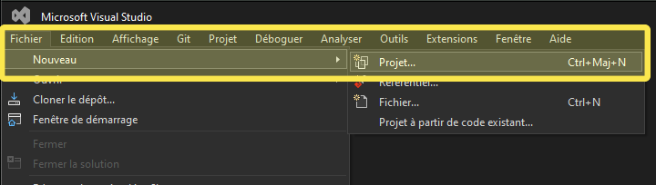

Une fenêtre de configuration de projet s'ouvrira. Vous devrez choisir le type de projet que vous voulez créer. Pour ce cours, nous allons créer un projet vide au départ afin d'apprendre depuis les tout débuts.

- Tapez **C++** dans la barre de rechercher afin de limiter les choix.
- Sélectionnez **Projet vide**.
- Appuyez sur **Suivant**.

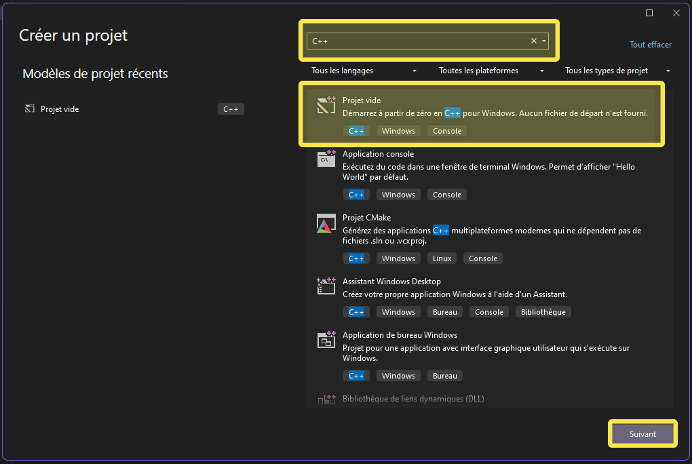

Comme vous le savez maintenant, une solution peut contenir plusieurs projets. La structure de ce cours voudra que nous utilisions la solution comme point d'entrée de tous les codes que vous ferez en activité lors de la session.

- Nommez le projet `01-HelloWorld` (dans le champ _Nom du projet_).
- Pour ce qui est de l'emplacement, il est demandé, pour des raisons d'unicité, d'utiliser cette nomenclature pour les répertoires de vos projets : `C:\Users\VotreNomUtilisateur\CShawi\1Q2\Projets`.
- Cochez la case **Placer la solution et le projet dans le même répertoire** afin d'éviter de créer des sous-répertoires inutiles.
- Vous n'aurez donc rien à entrer dans le champ **Nom de la solution** car nous la nommerons en prochaine étape.

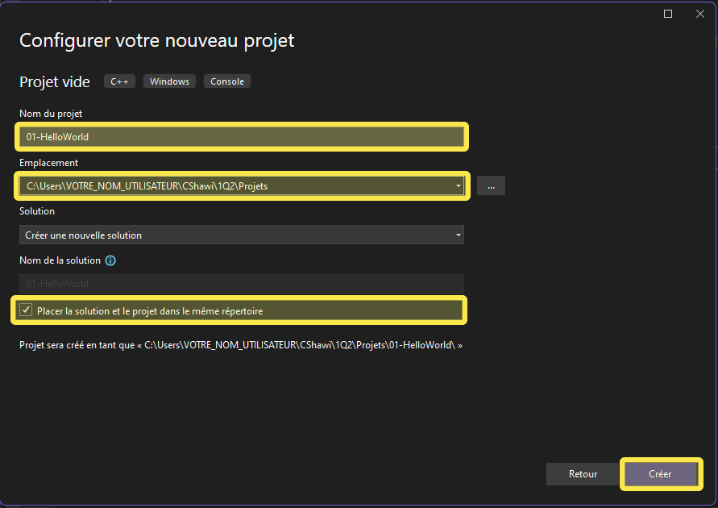

## 2. Configuration de la solution centrale

Une fois que vous avez configuré votre projet, vous devrez configurer votre solution. La solution est le conteneur parent de tous les projets que vous aurez dans votre session de travail. Vous pouvez avoir plusieurs projets dans une solution. Débutons par lui donner un nom significatif.

- Cliquez sur le bouton de droite sur **Solution '01-HelloWorld' (1 sur 1 de projet))** et Sélectionnez **Renommer**.

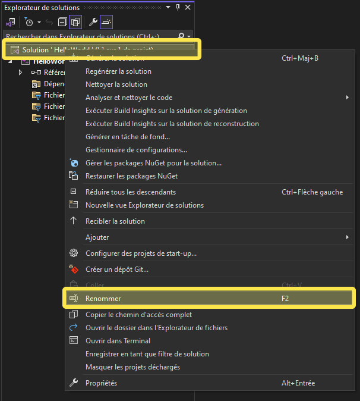

- Entrez `1Q2-Projets` comme nom de solution.

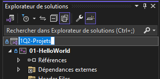

## 3. Création d'un programme vide mais fonctionnel

Maintenant que vous avez créé votre projet et votre solution, vous pouvez ajouter du code C++ à votre projet. Pour ce faire, vous devrez ajouter un fichier source à votre projet.

- Cliquez avec le bouton droit sur le nom de votre projet `01-HelloWorld` dans l'Explorateur de solutions.
- Sélectionnez **Ajouter** > **Nouvel élément...**.

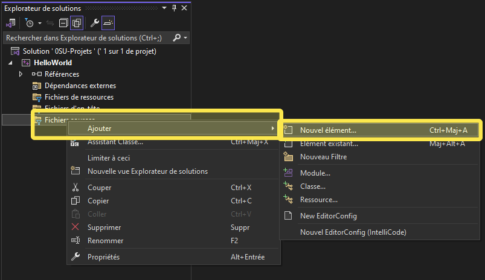

- Nommez le fichier le même nom que le projet (ce qui sera valide pour les prochains projets également) `01-HelloWorld.cpp` et appuyez sur **Ajouter**.

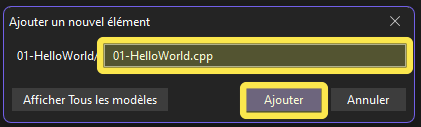

Vous êtes maintenant prêt à écrire votre premier programme en C++. Débutons par créer u programme qui ne fait absolument rien d'autre que de se placer dans la liste des processus du système d'exploitation (aucun affichage à l'écran).

- Double-cliquez sur le fichier `01-HelloWorld.cpp` pour l'ouvrir dans l'éditeur de code.
- Entrez le code suivant sans vous soucier de ce qu'il fait pour l'instant. Ce code représente le squelette de base de tout programme en C++.:

```cpp
int main() {
  //Emplacement du code
  return 0;
}
```

## 4. Compilation et exécution du programme

La compilation est le processus qui converti le code source écrit en C++ en un seul fichier (.exe) en code machine que l'ordinateur peut exécuter.

### 1) Pré-traitement (preprocessing) :

Lecture des #include, #define, etc. et des fichiers d'en-tête.

### 2) Compilation (compilation) :

Création du code assembleur spécifique à l'architecture cible.

### 3) Assemblage (assembly) :

Convertit le code assembleur en code machine (fichiers objets).
Ces fichiers ne sont pas exécutables / utilisables.

### 4) Édition des liens (linking) :

Combine les fichiers objets en un seul fichier exécutable.
Exemple `run.exe`, `f1gp5.exe`, `unreal.exe`, `unity.exe`.

### 5) Exécution (execution) :

Exécute le programme sur le système d'exploitation en question.

Maintenant que vous avez écrit votre premier programme, vous pouvez le compiler et l'exécuter.

- Appuyez sur **Ctrl + F5** pour compiler et exécuter le programme.

OU

- Cliquez sur le bouton **Débogueur local Windows** dans la barre d'outils.

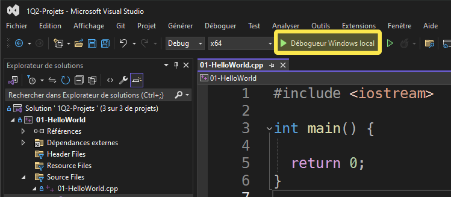

Vous devriez voir une fenêtre de console s'ouvrir et afficher beaucoup de texte incompréhensible. C'est normal. Ce texte est généré par le compilateur et le système d'exploitation. Vous allez y trouver :

### Le répertoire de travail de l'exécutable.

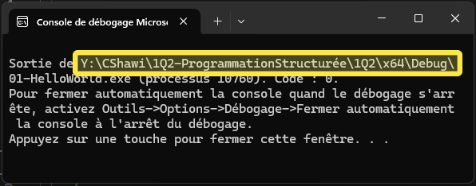

### Le fichier créé par le **linking** lors de la compilation.

Il serait possible de lancer ce fichier directement en double-cliquant dessus pour voir le résultat de l'exécution.
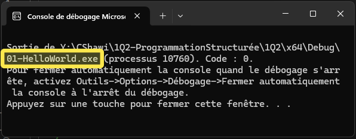

### Le numéro du processus lancé par le système d'exploitation.

Il est possible de voir ce processus dans le gestionnaire de tâches de Windows.
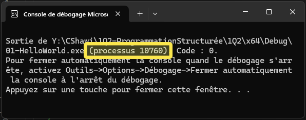

### Le code d'erreur de retour de l'exécution. Si = 0, tout s'est bien passé.

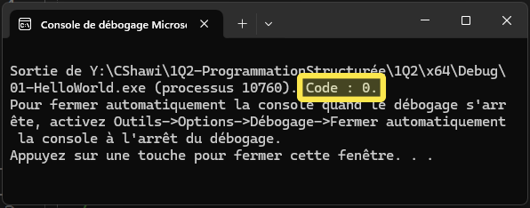

### Un message de proposition de configuration.

Nous modifierons les configuration plus tard dans le cours.
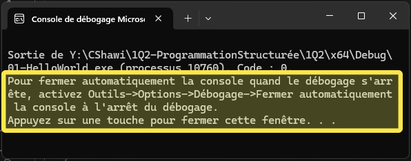

### Explications du code

```cpp
int main() {
```

La fonction `main` est la fonction principale de tout programme en C++. C'est la fonction qui est appelée lorsque le programme est exécuté.

```cpp
return 0;
```

`int` est le type de retour de la fonction `main`. Le type de retour de la fonction `main` est un entier qui représente le code de retour du programme. Un code de retour de 0 signifie que le programme s'est terminé correctement. Un code de retour différent de 0 signifie qu'il y a eu une erreur.
Tout au long de notre cours, nous utiliserons `return 0;` pour indiquer que le programme s'est terminé correctement. Nous verrons plus tard comment utiliser des codes de retour différents de 0 pour indiquer des erreurs.

```cpp
}
```

l’accolade fermante indique la fin de la fonction `main`. C'est la fin du programme.

## 5. Création du fameux HelloWorld

- Remplacer le code précédent par celui-ci :

```cpp
#include <iostream>

int main() {
  std::cout << "Hello, World!" << std::endl;
  return 0;
}
```

- Appuyez sur **Ctrl + F5** ou cliquez sur **Débogueur local Windows** pour compiler et exécuter le programme.

Vous devriez voir le texte `Hello, World!` s'afficher dans la fenêtre de la console. Félicitations! Vous avez écrit votre premier programme en C++.

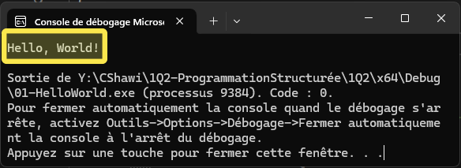

### Explications du code

```cpp
std::cout << "Hello, World!" << std::endl;
```

Cout (pour Console OUTput) est un objet de la bibliothèque standard de C++ qui permet d'afficher du texte à la console. Il est utilisé en utilisant l'opérateur `<<` pour envoyer du texte à la console. L'opérateur `<<` est utilisé pour envoyer des données à un flux de sortie (comme la console mais pourrait également être une imprimante ou tout autre périphérique de **_sortie_**).

Tous semble bien fonctionner. Vous avez maintenant un environnement de développement fonctionnel pour le C++ et vous avez écrit votre premier programme. Mais attendez, nous n'avons pas encore tenté d'écrire du texte avec des accents à la console.

## 6. Écriture de texte accentué à la console

Remplacez le code à l'écran par celui-ci :

```cpp
#include <iostream>

int main() {
  std::cout << "Écriture à la console" << std::endl;
  return 0;
}
```

N'obtenez-vous pas des caractères étranges à la place des accents?

C'est normal. La console de Windows n'est pas configurée pour afficher des caractères accentués par défaut. Nous devrons configurer la console pour afficher les caractères accentués.

- Ajoutez la ligne suivante au début de votre programme, première ligne à l'intérieur de la fonction `main` :

```cpp
std::setlocale(LC_ALL, "");
```

- Lancer le programme avec **Ctrl + F5** ou **Débogueur local Windows**.

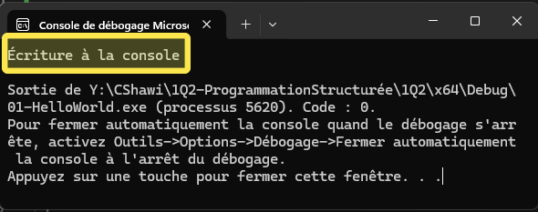

## 5. Utilisation du **namespace** `std`

Vous avez peut-être remarqué que nous avons utilisé `std::` avant `cout` et `endl`. Cela est dû au fait que `cout` et `endl` sont des objets de la bibliothèque standard de C++ qui sont définis dans l'espace de nom `std`. Pour éviter d'avoir à écrire `std::` avant chaque objet de la bibliothèque standard, nous pouvons utiliser la directive `using namespace std;` pour dire au compilateur que nous voulons utiliser l'espace de nom `std` par défaut.

- Remplacez le code précédent par celui-ci :

```cpp
#include <iostream>
using namespace std;

int main() {
  setlocale(LC_ALL, "");
  cout << "Écriture à la console" << endl;
  return 0;
}
```

Le code dans la fonction `main` est maintenant plus lisible et plus court. C'est une bonne pratique de mettre les directives `#include` au début du programme et de mettre `using namespace std;` juste après les directives `#include`.

## 5. Reconnaître les erreurs potentielles

- Remplacez le code précédent par celui-ci :

```cpp
#include <iostream>
using namespace std;

int main() {
  setlocale(LC_ALL, "");
  ecrireConsole("Bonjour !");
  cout >> "Écriture à la console" << endl;
  return 0;
}
```

- Lancer le programme.

Remarquez que Visual Studio vous indique une erreur dans le code. Pour voir l'erreur :

- Cochez la case **Ne plus afficher cette boîte de dialogue** et appuyez sur **Non**.

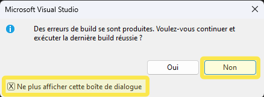

Une fenêtre s'ouvrira à partir de maintenant pour vous indiquer les erreurs dans le code, le cas échéant.

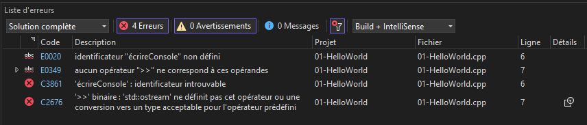

Il existe, au total, plus de 1000 messages d'erreurs différents que le compilateur peut vous donner. Il est important de lire ces messages d'erreurs pour comprendre ce qui ne va pas dans votre code. Les messages d'erreurs sont souvent cryptiques mais ils vous donnent des indices sur ce qui ne va pas dans votre code.

Ces messages d'erreurs sont souvent accompagnés de numéros de ligne et de colonne qui vous indiquent où se trouve l'erreur dans votre code. Vous pouvez cliquer sur ces messages pour vous rendre directement à l'endroit où se trouve l'erreur dans votre code.

Ils sont également regroupés en plus de 7 catégories d'erreurs différentes. Les 3 catégories d'erreurs les plus courantes sont :

### Erreurs de syntaxe

Ces erreurs sont causées par des erreurs de syntaxe dans votre code. Par exemple, si vous oubliez un point-virgule à la fin d'une ligne, le compilateur vous donnera une erreur de syntaxe.

```cpp
int main() {
    std::cout << "Hello World"  // Manque un point-virgule ici
}
```

### Erreurs de logique

Ces erreurs sont causées par des erreurs de logique dans votre code. Par exemple, si vous essayez d'utiliser une variable qui n'a pas été déclarée, le compilateur vous donnera une erreur de logique.

```cpp
int main() {
    int a = 5, b = 10;
    int sum = a - b;  // Logique incorrecte, devrait être a + b
}
```

### Erreurs de compilation

Ces erreurs sont causées par des erreurs de compilation dans votre code. Par exemple, si vous essayez d'utiliser une fonction qui n'a pas été déclarée, le compilateur vous donnera une erreur de compilation.

```cpp
int x = "Hello";  // Incompatibilité de type
```

Dans notre cas, l'erreur est une erreur de compilation. Le compilateur ne peut pas trouver la fonction `ecrireConsole` que nous avons appelée car elle n'existe pas. Les caractères `>>` sont également incorrects.

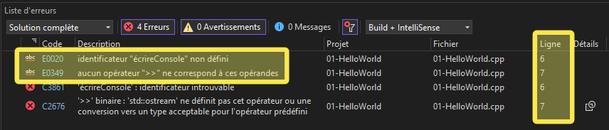

Il est toujours important de lire les messages d'erreurs pour comprendre ce qui ne va pas dans votre code. Ici c'est clairement indiqué que le compilateur ne peut pas trouver la fonction `ecrireConsole` et que l'erreur se trouve à la ligne #6 du fichier `01-HelloWorld.cpp`.

- Nous devons corriger cette erreur en remplaçant `ecrireConsole` par `cout` et `>>` par `<<` et relancer le programme.

```cpp
#include <iostream>
using namespace std;

int main() {
  setlocale(LC_ALL, "");
  cout << "Bonjour !" << endl;
  cout << "Écriture à la console" << endl;
  return 0;
}
```
## 6. Conclusion
Vous devriez maintenant être en mesure de créer n'importe quel programme en C++ avec Visual Studio. Vous avez appris à créer un projet, à écrire du code, à compiler et à exécuter un programme. Vous avez également appris à reconnaître les erreurs potentielles dans votre code et à les corriger.

<p align="Center"></p>
