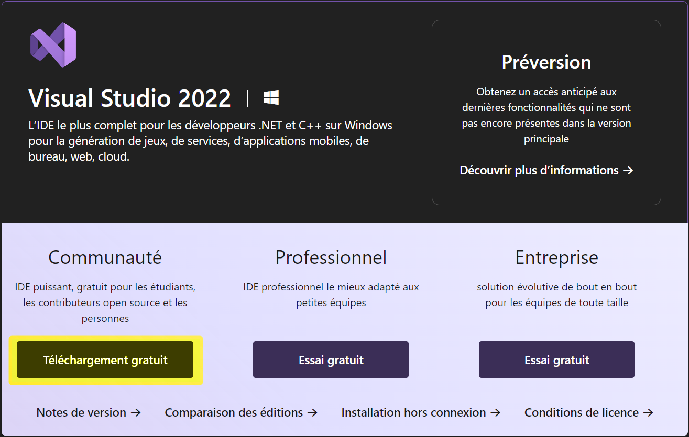
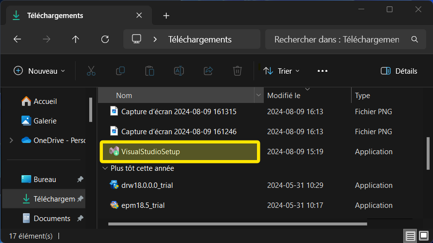
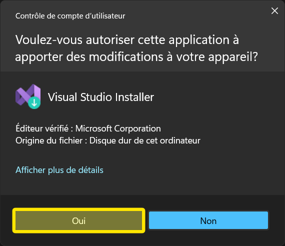
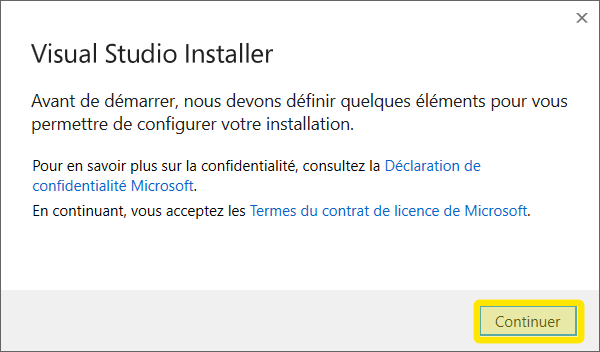
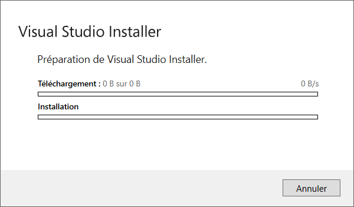
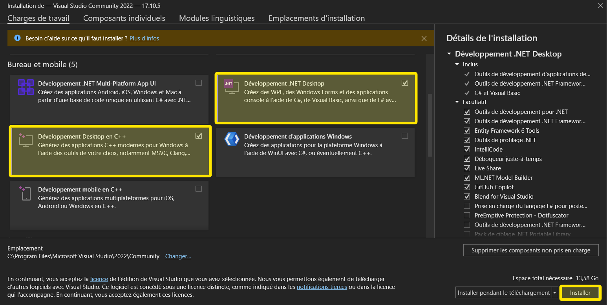
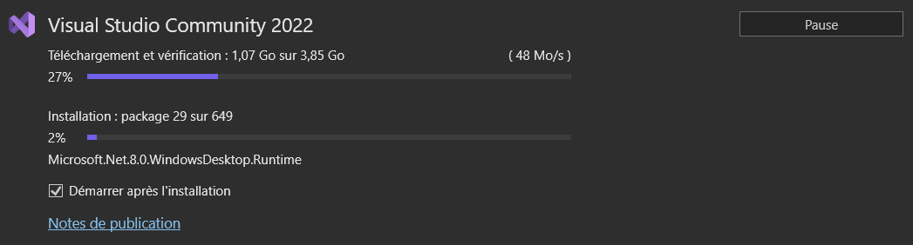
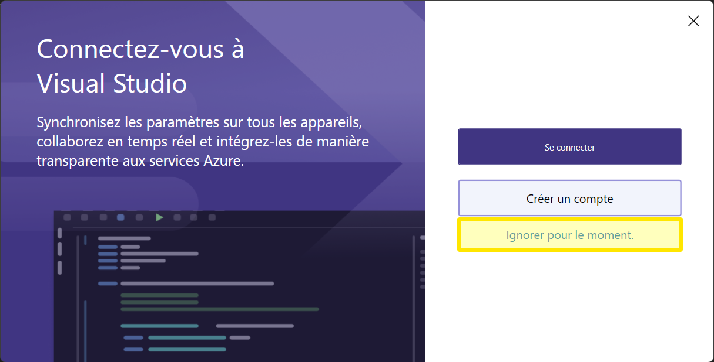
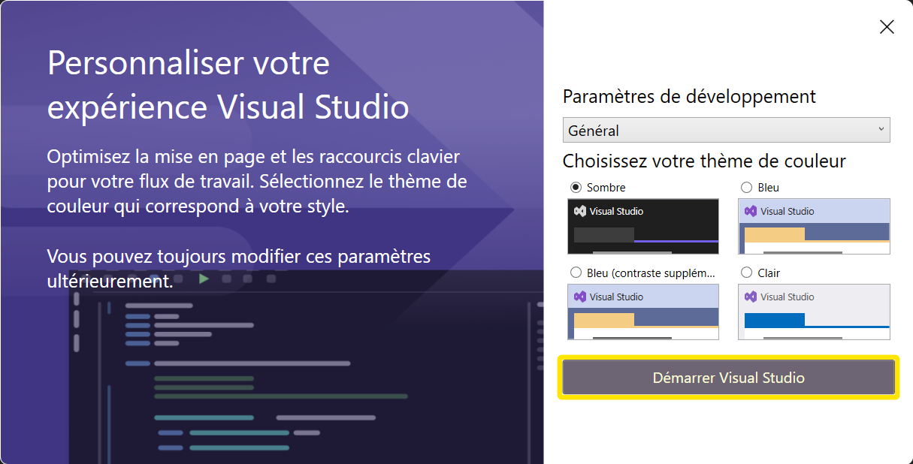
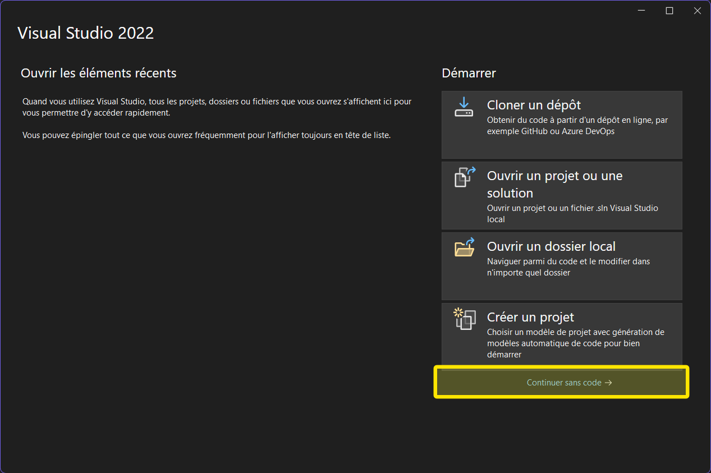

# Installation de Visual Studio

## 1. Téléchargement de Visual Studio

- Naviguez à l'adresse suivante : https://visualstudio.microsoft.com/fr/downloads/

- Sélectionnez la version **communauté** de Visual Studio 2022 en cliquant sur **Téléchargement gratuit**.

- Au besoin, confirmer votre emplacement de sauvegarde du fichier dans le répertoire **Downloads**.

## 2. Lancement de l'installation de Visual Studio

- Double-cliquez sur le fichier téléchargé pour lancer l'installation de Visual Studio.

- Sélectionnez **Oui** pour lancer l'installation de Visual Studio.

Visual Studio (Microsoft) vous informera qu'il est possible qu'il aie à vous demander d'entrer des information personnelles pour l'installation. 
- Cliquez sur **Continuer** pour poursuivre l'installation et, au besoin, cliquez sur **_Ignorer pour le moment_** pour installer Visual Studio sans configurer de compte.

- Patientez pendant la préparation de l'installation, cela devrait s'avéré assez rapide.

Visual Studio Installer vous demandera de choisir les composants à installer.  Pour le cours de programmation, vous aurez besoin de l'environnement de développement **Développement Desktop en C++**.  Dans un cours suivant vous aurez besoin de **Développement .NET Desktop**.
- Choisissez seulement ces deux environnement et cliquez sur **Installer** alors choisissez-le dès maintenant, cela sera fait 😀.  Dans le futur vous pouvez également choisir d'installer d'autres composants selon vos besoins.

- Patientez pendant l'installation de Visual Studio incluant vos environnements sélectionnés.  Cela peut prendre plusieurs minutes selon la vitesse de votre connexion Internet et la puissance de votre ordinateur.

Microsoft vous demandera probablement de vous inscrire à un compte Microsoft pour activer Visual Studio.

- Vous pouvez ignorer cette étape en cliquant sur **Ignorer pour le moment**.

Visual Studio Installer vous demandera de sélectionner un thème pour Visual Studio.  Vous pouvez choisir le thème **Clair** ou **Sombre** selon vos préférences.  Dans ce cours l'enseignant utiliser le thème **Sombre**.

- Sélectionnez le thème **Sombre** et cliquez sur **Démarrer Visual Studio** pour lancer Visual Studio.

Visual Studio vous demandera si vous souhaitez ouvrir un projet existant ou en créer un nouveau.
- Pour l'instant, nous ne créerons pas de projet car cette opération fait partie de la prochaine activité.Cliquer sur **Continuer sans code** pour ouvrir Visual Studio seulement, avec aucun projet.

- Félicitations, vous avez installé Visual Studio avec succès!  Vous pouvez maintenant commencer à programmer en C++ avec Visual Studio.

