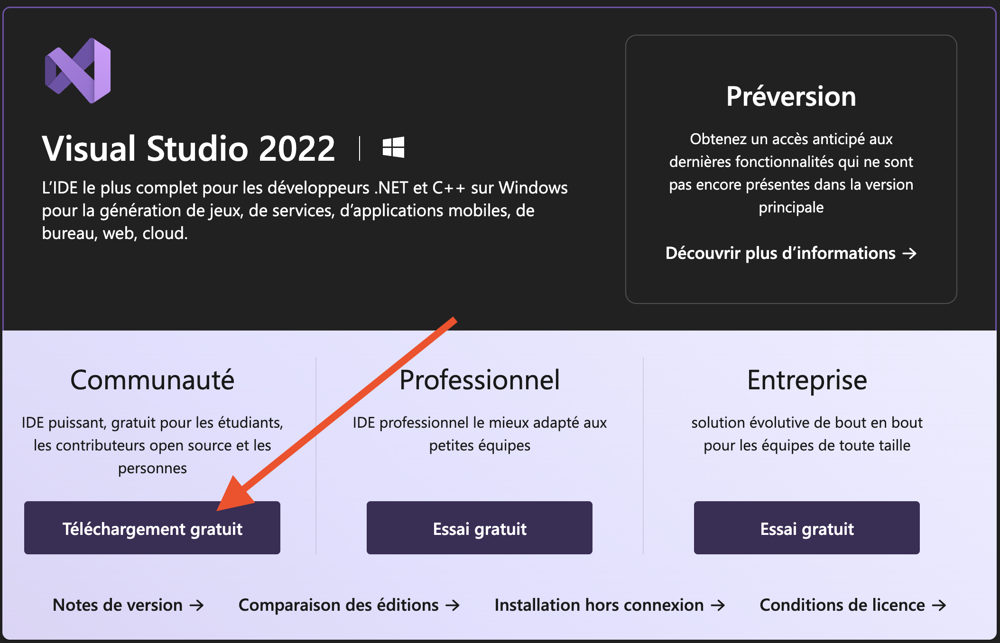
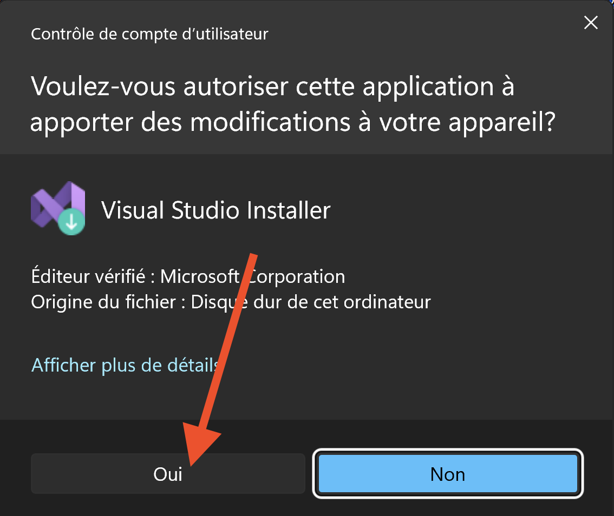
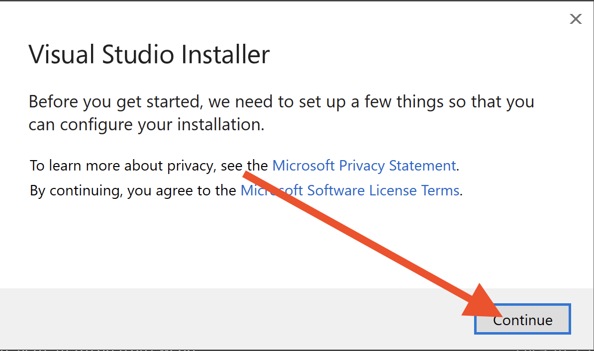

# Installation de Visual Studio

## 1. Téléchargement de Visual Studio

- Naviguez à l'adresse suivante : https://visualstudio.microsoft.com/fr/downloads/

- Sélectionnez la version **communauté** de Visual Studio 2022 en cliquant sur **Téléchargement gratuit**.

- Au besoin, confirmer votre emplacement de sauvegarde du fichier dans le répertoire **Downloads**.

## 2. Lancement de l'installation de Visual Studio
- Double-cliquez sur le fichier téléchargé pour lancer l'installation de Visual Studio.

- Sélectionnez **Oui** pour lancer l'installation de Visual Studio.

Visual Studio (Microsoft) vous informera qu'il est possible qu'il aie à vous demander d'entrer des information personnelles pour l'installation. Cliquez sur **Continuer** ou **Continue** pour poursuivre l'installation et, au besoin, cliquez sur ***Ignorer pour le moment*** pour installer Visual Studio sans configurer de compte.

- Choix ici
- Choix 2 ici

