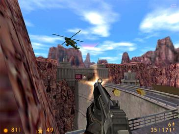

# Exercices 06 - Boucles do{}while()

Lien vers les [notes de cours](https://slides.com/hkoncept/1q2-05/fullscreen?token=6ntlmUIx#/14) sur les boucles `do()while{}`.

## Conditions

- Tous les numéros de l'exercice 05 doivent être programmés en utilisant `obligatoirement` une boucle `do{}while()`.
- Les [types de variable](https://en.cppreference.com/w/cpp/language/types) doivent `obligatoirement` être plus efficaces selon le contexte.
- Il doivent s'exécuter sans aucun avertissement dans Visual Studio et doivent être conforme à l'affichage présenté.

## Question 1 - Obtenir nombre pair

Écrire un algorithme afin d'obtenir un nombre pair de l'utilisateur.

```plaintext
Entrez un nombre pair : 5
Ce n'est pas un nombre pair. Essayez encore...

Entrez un nombre pair : 7
Ce n'est pas un nombre pair. Essayez encore...

Entrez un nombre pair : 2
Merci, vous avez entré un nombre pair !
```

## Question 2 - Obtenir un nombre entre intervalles

Écrire un algorithme afin d'obtenir de l'utilisateur un nombre entre une intervalle donnée par lui. Affichez `Trop petit` si le nombre entré est plus petit que `min` et `Trop grand` si le nombre entré est plus grand que `max`.

```plaintext
Entrez l'intervalle [Exemple 10 50] : 10 50
Entrez un nombre entre 10 et 50: 55
Trop grand. Essayez encore...
0
Trop petit. Essayez encore...
25
Merci, vous avez entré 25!
```

## Question 3 - Somme nombres pairs et impairs

Écrire un algorithme qui effectue la somme des nombres pairs ainsi que des nombres impairs d'une intervalle entrée par l'utilisateur conformément à l'affichage suivant :

```plaintext
Entrez l'intervalle [Exemple 10 50] : 10 50
La somme des nombres pairs de l'intervalle est de : 630
La somme des nombres impairs l'intervalle est de : 600
```

## Question 4 - Nombre de chiffres

Écrire un algorithme qui demande d'abord un très grand chiffre à l'utilisateur ([jusqu'à 20 chiffres](https://en.cppreference.com/w/cpp/language/types)) et qui calcule et retourne ensuite le nombre de chiffres présent dans le nombre entré. Le programme quitte seulement l'utilisateur entre exactement 15 chiffres.

- N.B. Pour bien réussir ce numéro vous devrez bien comprendre les différent types de variables entières.

```plaintext
Entrez le nombre de chiffres pour quitter le programme [1 à 20] : 15
Entrez un grand nombre entier : 1029348576858674356
Le nombre a 19 chiffres.
Entrez un grand nombre entier : 0909
Le nombre a 3 chiffres.
Entrez un grand nombre entier : 1010
Le nombre a 4 chiffres.
Entrez un grand nombre entier : 10101010102939485767
Le nombre a 20 chiffres.
Entrez un grand nombre entier : 019284758678345
Le nombre a 14 chiffres.
Entrez un grand nombre entier : 098727475869874
Le nombre a 14 chiffres.
Entrez un grand nombre entier : 398984857384573
Le nombre a 15 chiffres.
```

## Question 5 - Décompte d'un chiffres

Écrire un algorithme qui demande d'abord un chiffre de référence à l'utilisateur jusqu'à ce qu'il reçoive soit réellement un chiffre et qui demande ensuite `x` fois un grand nombre à l'utilisateur jusqu'à-ce dernier entre 0.

Le programme comptera pendant ce temps le nombre de fois que le chiffre de référence entré est présent dans les grands nombres selon cet affichage :

```plaintext
Entrez un chiffre de référence : -1
Entrez un chiffre de référence : 10
Entrez un chiffre de référence : 5
Entrez un grand nombre entier #1 [Exemple 10984] : 19023
Entrez un grand nombre entier #2 [Exemple 10984] : 15555
Entrez un grand nombre entier #3 [Exemple 10984] : 09500
Entrez un grand nombre entier #4 [Exemple 10984] : 30035
Entrez un grand nombre entier #5 [Exemple 10984] : 55015
Entrez un grand nombre entier #6 [Exemple 10984] : 0
Le chiffre 5 apparaît 9 fois.
```

## Question 6 (défi) - FPS Game (RunForestRun)
<p align="Center"></p>

Écrire un algorithme afin de créer une mini simulation visuelle de déplacement d'un joueur dans un [jeu de type FPS](https://fr.wikipedia.org/wiki/Jeu_de_tir_%C3%A0_la_premi%C3%A8re_personne#:~:text=Le%20jeu%20de%20tir%20%C3%A0,travers%20les%20yeux%20du%20protagoniste.). Le joueur utilisera les touches `wsad` afin de se déplacer à l'éran.

- Aucune restriction visuelle ici, laissé à votre créativité !
### Créativité
- Bien entendu, le résultat ne se fera voir qu'à la console.
- N'hésitez à à communiquer avec l'enseignant pour des idées / trucs.
- Le programme le plus créatif sera présenté en classe la semaine suivante.

<p align="Center"></p>
