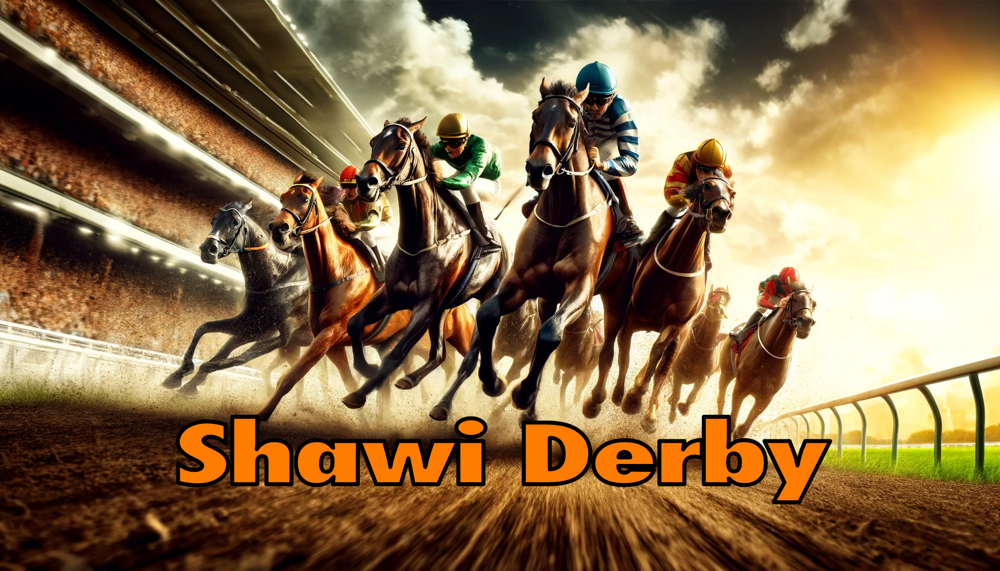

# TP3 - The Shawi Derby Extended (8%)

## Introduction

Vous avez présenté votre application de Derby à votre client, l'entreprise GameZone Inc., et il est vraiment satisfait de votre travail. Il souhaite donc continuer avec vous pour améliorer le projet que son employé Cédrik à débuter d'élaborer en se basant sur votre travail. Le client demande maintenant de :

1. Partir une nouvelle solution/projet explicitement nommé `ShawiDerbyExtended` avec le code de Cédrik en ne modifiant rien de ce qui est déjà présent mais en utilisant tout le code présent.
2. Lire les données de chevaux et de derbies depuis une base de donnée CSV.
3. Enregistrer les données dans des structures nommées `Derby` et `Horse`.
4. Fractionner le projet fonctions réutilisables.
5. Retourner le tout au client avant la date de remise en format `.zip` en prennant bien soin de compresser l'ensemble du projet incluant le fichier de solution.

GameZone Inc. a fournit une vidéo du résulat désiré et vous engage pour les deux prochaines semaines en vous payant jusqu'à 3000$ selon le résultat reçu.  Votre résultat à l'écran doit correspondre parfaitement à ce vidéo afin d'obtenir le cachet entier...

## Présentation de GameZone Inc.

> ATTENTION: Ne pas tenir compte du vacillement de l'écran lors de l'avancemenet d'un cheval. Il existe deux méthodes d'affichage à l'écran et comme je vous demande la plus simple, ce sintillement est normal et acceptable (limitation de la console).

- Affichage de cet écran d'accueil où il est `obligatoire` d'appuyer sur ESPACE pour pouvoir continuer.

